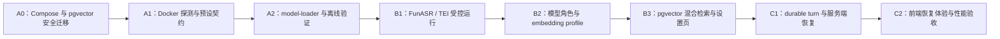

# Docker 本地 AI 与实时面试可靠性实施计划

> 依据：[Docker 本地 AI 与实时面试稳定性设计](../specs/2026-07-25-docker-local-ai-and-live-reliability-design.md)
>
> 状态：用户已授权进入开发
>
> 策略：先完成可离线验证的 Docker 交付底座，再接入本地能力，最后修改实时回合语义；任一阶段均不以真实模型下载或 GPU 作为测试前提。

## 1. 本次实施边界

本轮把已确认的方案拆成三个可以独立提交和回滚的阶段：

1. **Phase A：Docker 交付底座** — pgvector、受控 Docker 探测、版本化模型预设、一次性 loader 与离线验收路径。
2. **Phase B：本地能力闭环** — Docker FunASR、Docker TEI、专用 ASR/embedding 契约、embedding profile、pgvector 混合检索与设置页。
3. **Phase C：实时可靠性** — durable turn、断线不中止生成、退避重连、真实阶段事件、分段超时和公平计时。

先开始 Phase A。它不会要求用户下载 SenseVoice、E5 或 BGE-M3，也不会改变现有的云端模型、文字回答和既有 PostgreSQL volume。

## 2. 实施不变量

- 本地 ASR 与 embedding 仅由 Docker 容器运行；宿主机不安装 FunASR、TEI、PyTorch 或模型运行时。
- 浏览器不得执行 Docker 命令、读取 Docker socket、读取模型 volume 或接收模型来源凭证。
- 所有 Docker 子进程均使用固定参数列表和 `shell=False`；预设、来源和操作为后端枚举，不能由浏览器拼接命令、路径或镜像。
- 模型下载、镜像拉取、模型预热、重嵌入和索引构建不能与正在进行的面试并发启动。
- 本地服务失效时绝不静默上传音频、简历、记忆或回答；文字回答和 PostgreSQL 全文检索始终可用。
- PostgreSQL 和将来的本地 AI 端口仅绑定 `127.0.0.1`。保留既有 `POSTGRES_PORT` 与本地数据库 URL 兼容性。
- 每个里程碑先添加/调整失败测试，再做最小实现；Python 命令先激活根目录 uv 环境。

## 3. 依赖关系

## 4. Phase A：Docker 交付底座

### A0：Compose 与 pgvector 安全迁移

文件：

- 修改 `docker-compose.yml`
- 新增 `backend/alembic/versions/0007_enable_pgvector.py`
- 扩展 `backend/tests/models/test_database_schema.py`
- 修改 `.env.example`、`README.md`、`docs/local-development.md`、`docs/privacy.md`
- 新增 `docs/local-ai.md`

动作：

1. 保留 named volume 键 `interview-helper-postgres`，将 PostgreSQL 17 基础镜像替换为经验证的、固定 digest 的 pgvector PostgreSQL 17 镜像；不更名 volume，也不使用 `down -v`。
2. 将 PostgreSQL port mapping 固定为 `127.0.0.1:${POSTGRES_PORT:-5432}:5432`；未来 ASR/embedding 也遵循相同边界。
3. 将 `CREATE EXTENSION IF NOT EXISTS vector` 写入手工 Alembic migration，而不是 init SQL，确保已有开发 volume 与测试数据库均被迁移。
4. 在说明文档中提供升级前备份、`docker compose config`、迁移和回滚检查步骤；明确 init SQL 只会作用于新 volume。

验收：

- 保留现有数据库 URL 后，开发与测试库都可升级到 head，并可验证 `vector` 扩展存在。
- `docker compose config --quiet` 与 `docker compose --profile model-loader config --quiet` 通过。
- 迁移不会删除或重建已有 volume；文档不建议用户执行破坏性 Docker 命令。

### A1：受控 Docker 环境探测与预设契约

文件：

- 新增 `backend/app/local_ai/__init__.py`
- 新增 `backend/app/local_ai/docker_probe.py`
- 新增 `backend/app/local_ai/loader_contract.py`
- 新增 `backend/app/schemas/local_ai.py`
- 新增 `backend/app/api/routes/local_ai.py`
- 修改 `backend/app/api/main.py`
- 修改 `backend/app/core/config.py`
- 新增 `backend/tests/local_ai/test_docker_probe.py`
- 新增 `backend/tests/api/test_local_ai.py`
- 新增 `docker/model-presets/schema.json`
- 新增 `docker/model-presets/sensevoice-small.json`
- 新增 `docker/model-presets/multilingual-e5-small.json`
- 新增 `docker/model-presets/bge-m3.json`

动作：

1. 实现只读 Docker probe：固定调用 `docker version`、`docker info`、`docker compose version` 和 compose config；以注入式进程执行器测试，不从请求参数构造命令。
2. API 仅返回安全状态：Docker/Compose 是否可用、Linux containers 能力、可用磁盘检查、GPU "available / unavailable / not-checked"，不返回绝对路径、环境变量、原始 stdout 或凭证。
3. 定义 model preset 的严格 JSON schema：id、能力、固定 revision、文件清单与 SHA-256、磁盘预算、维度、许可证、服务镜像 digest、伴随模型及 smoke-test 参数。浏览器只能选择枚举的 preset。
4. GPU 探测不拉取 CUDA 镜像、不调用用户自定义命令；无 GPU 是可用 CPU 路线，不是安装失败。

验收：

- 无 Docker 的测试机可通过 fake subprocess 完成所有单测；Docker 不可用时 API 返回可行动的诊断而非 500。
- 真实开发机的 read-only probe 和 compose config 不会拉取镜像、下载模型或启动 GPU 容器。
- 预设 JSON 在 CI 中通过 schema 校验，并拒绝变动 revision、缺失 hash 或任意本地路径。

### A2：model-loader 与离线验证闭环

文件：

- 新增 `docker/model-loader/Dockerfile`
- 新增 `docker/model-loader/requirements.lock`
- 新增 `docker/model-loader/entrypoint.py`
- 修改 `docker-compose.yml`
- 新增 `docker/model-loader/tests/fixtures/*`
- 新增 `docker/model-loader/tests/test_entrypoint.py`（容器内或纯逻辑单测）

动作：

1. 新增一次性 `model-loader` compose profile、版本化模型 named volume 和状态 volume；运行服务只能挂载已验证的 active 路径。
2. loader 使用固定版本的 ModelScope 客户端，状态机固定为 `staging -> resumed -> checksummed -> smoke-tested -> active`；只有成功后以原子标记切换 active。
3. 默认源为 ModelScope，Hugging Face 是显式备用，离线导入必须携带受支持 preset 的 manifest；运行时不得在首请求自动下载主模型或伴随模型。
4. 添加无网络的离线 fixture 验证：一个小型预哈希文件、合法 manifest 与错误 checksum；以 `--network none` 跑验证任务，不下载真实模型、不依赖 GPU。

验收：

- 合法 fixture 在隔离网络中从 staging 成为 active；checksum 错误不会替换旧 active。
- loader 日志与状态文件不含 API key、用户数据或绝对宿主路径。
- Docker image、ModelScope 依赖和每个服务镜像都固定 tag/digest；真实大模型下载只在用户显式安装操作中发生。

## 5. Phase B：本地能力与混合检索

### B1：受控 FunASR / TEI 服务

文件：

- 新增 `docker/funasr/Dockerfile` 与受控启动配置
- 扩展 `docker-compose.yml`
- 修改 `backend/app/providers/openai_transcription.py`
- 修改 `backend/app/providers/openai_compatible.py`
- 修改 `backend/app/providers/factory.py`
- 扩展 `backend/tests/providers/test_transcription.py`、`test_openai_compatible.py`

动作：

1. `local-asr` 以 FunASR + FFmpeg 提供仅回环绑定的 `/v1/audio/transcriptions`；加载模型目录而非联网模型 ID，覆盖浏览器 `webm` 与 `m4a` 冒烟测试。
2. `local-embeddings` 以 TEI 提供仅回环绑定的 `/v1/embeddings`；轻量 preset 为 multilingual-e5-small，高质量 preset 为 BGE-M3。
3. 在 OpenAI-compatible provider 正式实现 embeddings 请求/响应校验、超时、大小限制和稳定错误码；聊天 health check 不得再冒充 ASR 或 embedding 检测。
4. 为 ASR/embedding 引入能力特化的 health check；普通聊天连接不能绑定到这些角色。

### B2：托管连接、角色绑定与安装状态

文件：

- 修改 `backend/app/db/models/common.py`、`model_connection.py`
- 修改 `backend/app/schemas/model_connection.py`
- 修改 `backend/app/services/model_connections.py`
- 修改 `backend/app/api/routes/model_connections.py`、`transcriptions.py`
- 新增相应 Alembic migration 与 API/service tests

动作：

1. 为本地托管服务建立不可编辑 endpoint 的连接表示或独立安装记录，避免把本地 FunASR/TEI 伪装成需要用户填写 API key 的普通连接。
2. 将 role resolver 分为聊天、专用转写与 embedding 三类 exact-only resolver；禁止 Transcriber/Embedding 回退到 Interviewer。
3. 设置页仅在本地容器已完成 health + 短真实推理后展示“可用于面试”；不通过时仍可选云端或文字路径。

### B3：embedding profile 与 pgvector 混合检索

文件：

- 新增 embedding profile / vector record 数据模型与 Alembic migration
- 修改 `backend/app/memory/retriever.py`、`writer.py`、相关 services/workers
- 扩展 `backend/tests/memory/` 与 `backend/tests/services/`
- 修改 `frontend/src/features/settings/models/*`
- 新增本地 AI 设置组件、API、类型与测试

动作：

1. 独立存储向量与 embedding profile，不把混合维度向量塞进 `MemoryItem`。profile 固定模型、revision、维度、归一化、query 指令和索引空间。
2. 同时检索 pgvector 语义候选和既有 PostgreSQL FTS 候选，在已有 pinned、置信度、时效和上下文排序上融合；服务缺失时完整回退 FTS。
3. 每次只能有一个 active embedding profile；切换模型创建新 profile、后台重嵌入、完成后原子切换，旧新向量绝不混检。
4. 初期精确搜索；足够 chunks 后才在后台建 HNSW，且在面试期间暂停。
5. UI 明确区分“云端 API / 本地轻量 / 本地高质量”，显示安装空间、CPU/GPU 提示、下载来源、隐私边界与可恢复操作。

## 6. Phase C：实时面试可靠性

### C1：durable turn 与服务端恢复

文件：

- 修改 interview / realtime 数据模型并新增 Alembic migration
- 修改 `backend/app/api/routes/interview_live.py`
- 修改 `backend/app/services/interview_orchestrator.py`
- 扩展 `backend/tests/realtime/test_state_machine.py`、`test_websocket_protocol.py`

动作：

1. 用户答案提交后立即持久化 `turn.state=preparing`；provider 生成与单个 WebSocket 解耦，socket 断开不取消模型流。
2. 最终 assistant 消息先落库，再向所有活动连接广播；事件重放外增加会话 snapshot 兜底。
3. 生成租约超时后提供可重试状态；只在没有输出 token 且错误可重试时自动重试一次。
4. 将连接、首 token、流中空档、整轮四类超时独立配置和记录；系统等待期间暂停计时。

### C2：前端恢复体验与性能验收

文件：

- 修改 `frontend/src/lib/realtime/interviewSocket.ts` 与测试
- 修改 `frontend/src/features/interviews/live/LiveInterviewPage.tsx` 与测试
- 修改 `frontend/src/features/live-interview/VoiceRecorder.tsx` 与测试
- 修改样式与 Playwright 面试 E2E

动作：

1. 用带抖动的指数退避替代固定 800ms 重连；对不可恢复关闭码停止重试，并保留“回答已保存”的明确提示。
2. 显示真实阶段事件：回答已保存、上下文准备、请求模型、流式回复、转写确认；不显示虚假百分比或推理内容。
3. 将 token delta 批量到 30–50ms 渲染，8 秒后才提示等待异常；提供重新生成、继续等待、暂停和文字回答等明确动作。
4. 音频转写失败、超时或本地服务停止时始终让用户确认/编辑或直接提交文字，不自动切云端。

## 7. 验证矩阵与提交边界

每个阶段至少执行受影响的测试、Ruff、Alembic check 和前端 Vitest；跨阶段前执行完整后端/前端套件。Docker 验证分为无 Docker unit tests、可选 Docker config tests、显式安装模型后的真实 smoke test 三层，CI 不下载多 GB 模型。

建议提交：

1. `feat(local-ai): add pgvector and docker capability diagnostics`
2. `feat(local-ai): add verified model loader foundation`
3. `feat(local-ai): run managed FunASR and embedding services`
4. `feat(memory): add embedding profiles and hybrid retrieval`
5. `feat(realtime): make interview turns recoverable`
6. `feat(ui): guide local AI setup and meaningful waits`

每次提交仅包含当前里程碑相关文件；不暂存或覆盖用户已有变更。完成 Phase A 后先进行一次 Docker Compose、迁移、离线 fixture 和文档联合验收，再开始真实服务接入。
