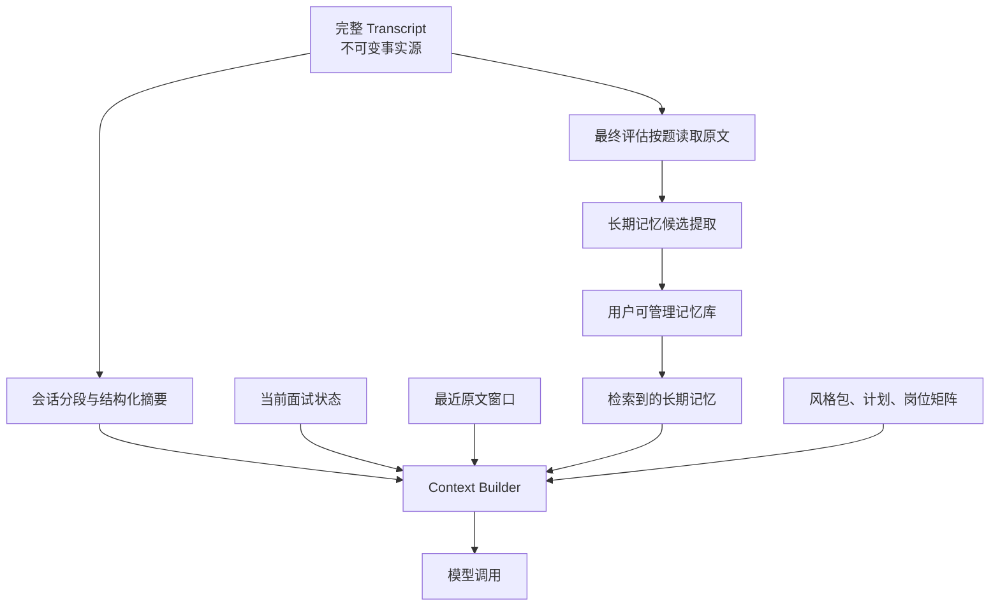

# 上下文管理与记忆系统设计规格

> 产品：Interview Helper
> 方案：分层上下文与结构化长期记忆
> 状态：设计已由用户确认
> 日期：2026-07-18

## 1. 目标

模拟面试的实时对话会持续累积公司风格、面试计划、简历片段、题目、用户回答、代码附件和追问。系统必须在模型上下文窗口与成本约束内保持面试连续性，同时避免摘要失真影响最终评估。

本系统要同时解决两个不同问题：

1. **会话内上下文管理**：决定每一次模型调用应携带哪些信息、何时压缩、如何保留未解决追问。
2. **跨会话长期记忆**：保存对未来面试有价值的结构化事实、能力趋势和用户偏好，并允许用户控制。

完整原始消息始终是事实源。摘要和长期记忆都是派生数据，不能覆盖原文，也不能成为最终评估的唯一依据。

## 2. 非目标

- 不把全部历史会话长期塞入每次模型调用。
- 不依靠模型“自己记住”上下文状态。
- 不在 MVP 中建设知识图谱或强依赖向量数据库。
- 不保存模型隐藏推理过程。
- 不从单次低质量回答永久推断用户能力。
- 不让长期记忆静默覆盖简历、用户明确陈述或已确认事实。
- 不用摘要替代当前问题、最近回答、未解决追问或最终评估证据。

## 3. 分层模型



### 3.1 L0：完整消息记录

`InterviewMessage` 和 `AnswerAttachment` 保存完整、按序、不可变的会话事实。

- 消息修改通过更正记录实现，不原位覆盖。
- 每条消息有 session sequence、角色、创建时间、确认状态和 token 统计。
- 流式 token 不逐条入库，只保存最终确认消息。
- 代码、语音转写和其他附件保存独立 ID，由消息引用。
- 删除整场会话时，相关派生摘要、快照和长期记忆来源一并处理。

### 3.2 L1：实时会话状态

`InterviewContextState` 是确定性的结构化状态，不由模型自由维护：

- 当前计划题目和追问序号。
- 已完成题目。
- 剩余时间与追问预算。
- 当前问题的目标能力。
- 已确认的用户回答要点。
- 未解决追问。
- 本题引用的简历、题库和代码附件 ID。
- 面试官已提出但用户尚未回答的要求。

状态由 orchestrator 根据事件更新。模型可以提出状态更新建议，但不能直接写数据库状态。

### 3.3 L2：近期原文窗口

近期窗口保存当前问题相关的原文和最近若干轮对话：

- 当前主问题原文。
- 当前问题下的所有有效回答和追问。
- 上一个已完成问题的结束片段，用于自然衔接。
- 最近的澄清、纠错和用户主动补充。

近期窗口按语义边界维护，不固定为机械的最后 N 条消息。当前题目未结束前不得压缩其消息。

### 3.4 L3：会话分段摘要

一个 `ConversationSegment` 对应一个完整题目及其追问，或一个明确的会话阶段。分段关闭后生成 `ContextSummary`：

```text
ContextSummary
├── segment_id
├── covered_message_start/end
├── question_id
├── capability_tags[]
├── asked_question
├── user_core_answer
├── explicit_claims[]
├── decisions_and_tradeoffs[]
├── caveats_and_failures[]
├── unresolved_points[]
├── attachment_refs[]
├── evidence_message_ids[]
├── summarizer_model
├── schema_version
└── token_count
```

摘要必须保留 message ID。任何摘要字段都可回到原文验证。

### 3.5 L4：跨会话长期记忆

长期记忆只保存未来面试确实会复用的结构化内容：

- `project_fact`：用户明确陈述的项目事实、职责和技术选择。
- `stable_skill`：多次证据支持的稳定能力。
- `recurring_gap`：重复出现的薄弱点。
- `communication_preference`：用户明确选择的交互偏好。
- `interview_preference`：时长、压力程度、输入方式等偏好。
- `practice_goal`：用户主动设定的练习目标。

不保存闲聊、一次性措辞、模型推测的人格标签、健康或招聘敏感推断。

## 4. Token 预算管理

### 4.1 模型能力元数据

每个 `ModelConnection` 记录：

- `context_window_tokens`
- `max_output_tokens`
- `tokenizer_type`
- `supports_prompt_caching`
- `supports_token_count_endpoint`

用户未填写且 provider 无法返回时，连接测试必须要求选择保守的上下文档位，不能假设无限窗口。

### 4.2 TokenCounter 接口

优先顺序：

1. provider 官方 token count 接口。
2. 已知模型的本地 tokenizer。
3. provider 级保守估算器。

估算结果保存 `method` 和 `margin`。不确定模型默认增加至少 15% 安全余量。

### 4.3 有效输入预算

```text
effective_input_budget =
  context_window
  - reserved_output_tokens
  - protocol_overhead
  - safety_margin
```

默认分配不是硬切片，而是带最小保障和最大上限的优先队列：

| 层级 | 默认目标 | 是否可丢弃 |
| --- | --- | --- |
| 系统安全、角色规则 | 10% | 否 |
| 公司风格、轮次、计划和实时状态 | 15% | 否 |
| 当前题目和近期原文 | 35% | 否，超限时暂停并先压缩已完成段 |
| 会话摘要 | 15% | 可进一步合并旧摘要 |
| 长期记忆与简历检索 | 15% | 可降低数量 |
| 可选题库参考与额外背景 | 10% | 是 |

未使用额度可以向下层流转。固定规则和当前题目不能因为百分比不足被截断。

### 4.4 压缩阈值

阈值基于 `effective_input_budget`，而不是模型标称窗口：

- **60%：预压缩**。异步关闭已完成 segment 并生成摘要，不改变当前请求内容。
- **75%：替换旧原文**。已完成 segment 的原文从实时 prompt 中移除，以结构化摘要替代。
- **85%：紧缩检索**。减少低相关长期记忆、旧简历片段和可选题库背景。
- **95%：安全停止**。不再继续拼接，先完成强制压缩；仍超限则返回可恢复错误，不静默截断。

### 4.5 永不自动压缩的内容

- system 安全规则和面试官角色边界。
- 当前公司与轮次风格的有效字段。
- InterviewPlan 当前进度。
- 当前问题及其未结束追问链。
- 用户最近一次完整回答。
- 未解决问题和用户更正。
- 当前题目依赖的代码附件。
- 模型工具调用结果中的错误状态。

## 5. 上下文组装

`ContextBuilder` 是唯一允许构造 provider prompt 的组件。Agent 不直接查询数据库拼 prompt。

### 5.1 输入

- agent role。
- model connection 与 token 能力。
- session state。
- current question。
- style pack 和 plan 版本。
- retrieval query。

### 5.2 组装顺序

1. system、安全、数据边界。
2. agent 角色与公司/轮次行为。
3. InterviewPlan 和当前状态。
4. 当前问题与近期原文。
5. 相关会话摘要。
6. 相关简历片段、题目背景和长期记忆。
7. 输出格式和工具定义。

先按稳定 ID 去重，再按 token 预算裁剪。稳定前缀尽量保持顺序不变，以利用支持 provider 的 prompt caching，但系统不依赖缓存才能正确运行。

### 5.3 ContextSnapshot

每次重要模型调用保存审计快照：

- agent role 与 model connection ID。
- prompt schema version。
- 纳入的 message、summary、memory、resume 和 question ID。
- 每层 token 计数与估算方法。
- 被排除项目及原因。
- compaction level。
- provider request ID 和响应 usage。

默认不重复保存完整 prompt 文本，避免扩大隐私面；可在本地调试模式临时启用脱敏 prompt 捕获。

## 6. 摘要生成与校验

### 6.1 触发时机

- 当前题目正式结束。
- 用户暂停面试且存在未摘要的已完成题目。
- 达到 60% 预压缩阈值。
- 会话结束时补齐所有分段摘要。

### 6.2 生成方式

- 使用单独的 `context_summarizer` 模型角色；未绑定时回退到 Planner 模型。
- 输入只包含该 segment 原文和结构化状态，不包含无关历史。
- 输出必须匹配固定 Pydantic schema。
- 温度使用低值，禁止自由发挥建议。

### 6.3 校验

- 所有 evidence message ID 必须存在且位于 segment 范围内。
- explicit claims 必须能定位用户消息。
- unresolved points 不得被摘要为已解决。
- 代码要点必须引用 attachment ID。
- 校验失败执行有限次数修复；仍失败则保留原文并标记 `summary_failed`，不能丢弃该段原文。

### 6.4 摘要合并

非常长的会话允许把多个旧 `ContextSummary` 合并为 `SummaryBundle`。合并只压缩摘要，不再次读取或改写用户原文；bundle 保留子摘要 ID 和覆盖范围。

## 7. 长期记忆写入

### 7.1 MemoryItem

```text
MemoryItem
├── memory_type
├── canonical_key
├── content
├── structured_value
├── status
├── confidence
├── source_session_ids[]
├── source_message_ids[]
├── first_observed_at
├── last_verified_at
├── last_used_at
├── expires_at
├── pinned
└── version
```

状态：

- `proposed`：可在记忆中心审阅，但不自动影响面试。
- `active`：允许检索使用。
- `conflicted`：存在相互矛盾来源，暂停自动使用。
- `rejected`：用户明确拒绝，不重复建议相同内容。
- `expired`：超过有效期，不参与检索。

`pinned` 是独立布尔属性，不是生命周期状态。用户固定后，条目仍保持 `active`，但检索优先级最高；冲突或来源失效时仍须暂停使用，不能用固定状态绕过校验。

### 7.2 自动激活规则

- 用户明确陈述且与现有简历不冲突的项目事实，可以自动 `active`，并显示来源。
- 用户主动设置的偏好和练习目标直接 `active`。
- 能力优势、薄弱点和行为模式首次出现只进入 `proposed`。
- 同类弱点在至少两场独立会话中出现，且有对应证据时可自动 `active`。
- 敏感推断和无法定位原文的结论永不进入长期记忆。

### 7.3 冲突处理

相同 `canonical_key` 的新值不覆盖旧值：

1. 创建新版本。
2. 标记冲突来源。
3. 如果是时间自然变化，旧值过期、新值激活。
4. 无法判断时两者均 `conflicted`，等待用户确认。

## 8. 长期记忆检索

### 8.1 MVP 检索

MVP 使用 PostgreSQL：

- JSONB 字段过滤。
- 公司、岗位、能力、项目和记忆类型标签。
- PostgreSQL 全文检索。
- recency、confidence、verification、pinned 的加权排序。

pgvector 不作为运行依赖。后续启用时只增加候选召回，不绕过状态、权限和 token 预算过滤。

### 8.2 排序

```text
score =
  semantic_or_text_relevance
  + pinned_bonus
  + explicit_fact_bonus
  + confidence_weight
  + recency_weight
  + same_role_company_bonus
  - conflict_penalty
  - repeated_use_penalty
```

一次面试最多返回少量高相关记忆。系统应优先忘记“不相关”，而不是为了展示记忆能力强行插入历史。

### 8.3 使用边界

- Interviewer 可使用项目事实、用户偏好和已激活的练习目标。
- Interviewer 不直接看到历史评级数字，避免先入为主。
- Planner 可使用稳定能力和 recurring gap 调整覆盖。
- Evaluator 只使用当前会话原文和当前计划评分；长期记忆只能用于趋势比较，不能改变本场事实评级。
- Coach 可结合本场报告和已确认长期目标给出练习建议。

## 9. 最终评估的上下文策略

Evaluator 不把整场 transcript 一次发送给模型：

1. 按 PlanQuestion 获取该题完整原文和附件。
2. 对每题独立生成 `QuestionEvaluation`。
3. 汇总所有逐题结果、能力矩阵和本场元数据。
4. Aggregate pass 生成维度报告和练习计划。
5. 所有最终证据仍引用原始 message ID。

这样控制 token 消耗，并避免实时摘要的误差进入最终证据。

## 10. 用户控制界面

设置中新增“记忆管理”：

- 按项目事实、技能、薄弱点、偏好、目标分组。
- 显示内容、状态、置信度、来源会话、首次发现和最后使用。
- 支持编辑、确认、固定、拒绝、删除。
- 支持“忘记这场面试”：删除由指定 session 派生且无其他来源的记忆；多来源记忆仅移除该来源并重算置信度。
- 支持关闭跨场记忆；关闭后不再提取新记忆，也不检索旧记忆，但不自动删除，用户可另行清除。
- 面试准备页展示本场将使用的长期记忆摘要，允许临时排除。

## 11. 隐私与保留

- 默认本地存储。
- 原始 transcript、摘要、快照和长期记忆使用相同用户隔离边界。
- `ContextSnapshot` 默认只存引用和 token 元数据，不重复存完整敏感文本。
- 删除原始消息时，无法再验证的摘要和记忆必须失效或删除。
- 支持按会话、简历、项目或全部记忆清理。
- 日志不记录 prompt、回答全文、摘要正文和记忆正文。
- 数据导出区分原始记录与派生记忆，用户可以选择只导出其中一类。

## 12. 错误处理

- token 计数失败：使用保守估算并记录方法，不能默认零 token。
- 摘要失败：保留原文，重试或降低近期窗口，不删除事实。
- 检索失败：继续当前面试，不加载长期记忆。
- 上下文仍超限：停止本次模型调用并返回可恢复错误，后台先压缩已完成段。
- 记忆冲突：暂停自动使用并通知用户，不自动挑选看似更新的值。
- 记忆来源删除：重新计算剩余来源；无来源则删除或失效。
- provider 返回 usage 缺失：使用本地估算补记，并标记 `estimated`。

## 13. 可观测性

记录不含敏感正文的指标：

- 每次调用总输入/输出 token。
- 各上下文层 token 占比。
- 压缩触发次数和压缩率。
- 摘要失败/修复率。
- 检索候选数、实际使用数和被预算裁剪数。
- provider prompt cache 命中信息（可用时）。
- 单场面试 token 成本和每题成本。
- 长期记忆 proposed/active/conflicted 数量。

用户诊断页面显示本场 token 使用趋势，但不展示内部 prompt。

## 14. 数据模型增量

新增实体：

- `InterviewContextState`
- `ConversationSegment`
- `ContextSummary`
- `SummaryBundle`
- `ContextSnapshot`
- `MemoryItem`
- `MemorySource`
- `MemoryConflict`
- `MemoryUsage`

`ModelConnection` 增加 context window、output reserve 和 tokenizer 能力字段。`InterviewMessage` 增加确认状态、token 计数和 segment ID。

## 15. API 与事件

### REST

- `GET /api/interviews/{id}/context/diagnostics`
- `GET /api/memories`
- `PATCH /api/memories/{id}`
- `DELETE /api/memories/{id}`
- `POST /api/memories/{id}/pin`
- `POST /api/memories/{id}/reject`
- `POST /api/interviews/{id}/forget`
- `GET /api/interviews/{id}/memory-preview`

### SSE

摘要补齐和会话结束后的记忆提取作为后台 job，使用现有 job SSE 协议。

### WebSocket

新增服务端事件：

- `context.pressure`：只在需要 UI 提示时发送，不包含内部 prompt。
- `context.compacted`：通知恢复完成。
- `memory.preview.updated`：准备页的记忆预览变化。

实时面试正常情况下不应让用户感知压缩过程。

## 16. 测试策略

### 单元测试

- token 预算计算和安全余量。
- 60/75/85/95% 阈值行为。
- 当前问题与未解决追问永不被裁剪。
- summary schema 与证据范围。
- memory 状态迁移、冲突和过期。
- retrieval 排序与预算裁剪。

### 属性测试

- 任意消息序列经过压缩后，当前问题消息 ID 仍存在。
- ContextBuilder 输出 token 永不超过有效预算。
- 任何 active memory 至少有一个有效来源或用户手工创建标记。
- 删除 session 后不存在只引用该 session 的 active memory。

### 集成测试

- 长会话多次压缩后继续正确追问。
- provider context window 不同时生成不同但合法的快照。
- 摘要模型失败时回退原文并继续。
- 两场出现同一弱点后产生 active recurring gap。
- 冲突项目事实暂停检索，用户确认后恢复。
- Evaluator 分题评估仍能定位全部原始证据。

### 验收场景

1. 一场 60 分钟模拟在小上下文模型上至少触发两次压缩，面试官仍知道当前项目、已追问内容和未解决问题。
2. 用户第二次面试时，系统能使用上次确认的项目事实和练习目标，但不携带上次闲聊。
3. 用户删除一条记忆后，新会话不再检索到它。
4. 摘要中出现错误时，用户可定位来源；最终报告仍以原始 transcript 为准。
5. 切换到不同 context window 的模型后，无需重建会话数据即可重新组装上下文。

## 17. Phase 1 范围

Phase 1 必须实现：

- TokenCounter 抽象与保守估算。
- TokenBudget、ContextBuilder、ContextSnapshot。
- 按题 ConversationSegment 和结构化 ContextSummary。
- 60/75/85/95% 压缩策略。
- PostgreSQL 结构化长期记忆。
- 记忆管理基本页面。
- 分题 Evaluator 与聚合报告。
- token 与压缩诊断。

Phase 1 不实现：

- 向量数据库强依赖。
- 自动知识图谱。
- 跨用户共享记忆。
- 云端记忆同步。
- 从外部网页直接生成用户长期记忆。

## 18. 已确认决策

- 采用分层上下文，不采用纯滑动窗口摘要。
- 会话内压缩自动执行。
- 跨场只保存结构化、可追溯、可管理的记忆。
- 完整 transcript 是事实源，摘要是派生缓存。
- 最终评估按题读取原文，不依赖实时摘要评分。
- MVP 使用 PostgreSQL JSONB 与全文检索；pgvector 后置。
- 用户可以查看、编辑、固定、拒绝、删除和按场遗忘记忆。
