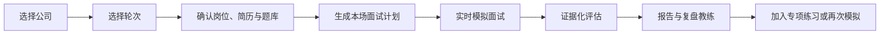

# 大厂 AI 模拟面试产品设计规格

> 工作名称：Interview Helper / Precision Console
> 状态：产品、交互与视觉方向已确认，等待书面规格评审
> 日期：2026-07-18
> 首发形态：开源、本地优先、单用户 Web 应用

## 1. 产品概述

Interview Helper 是一款面向技术候选人的开源 AI 模拟面试应用。它不只负责“出题”，而是根据目标公司、面试轮次、岗位方向、用户简历和个人题库，组织一场具有明确风格、连续追问和证据化评估的模拟面试。

首个垂直方向是大模型应用开发岗位。系统内置若干国内互联网公司的风格包，同时允许用户添加任意公司。对于新增公司，Agent 可以检索公开资料与社区经验，形成带来源、置信度和版本信息的公司面试风格草案，由用户确认后启用。

产品的核心差异不是“公司 Logo 列表”，而是可扩展的公司与轮次风格系统：同一道题在不同公司的不同轮次中，应体现不同的开场方式、追问深度、关注维度、节奏、压力程度和评价标准。

## 2. 目标与非目标

### 2.1 MVP 目标

- 用户在 3 分钟内完成模型、简历、题库和目标岗位的基础配置。
- 用户通过“公司 + 面试轮次”进入一次完整模拟面试。
- 面试官能围绕回答继续追问，而不是机械遍历题目列表。
- 题目同时来自用户题库、简历项目和公司风格包，且能解释选题来源。
- 面试结束后生成逐题证据、能力维度、改进建议和专项练习计划。
- 支持 OpenAI-compatible 与 Anthropic-compatible 两类模型协议，并允许保存多个模型配置。
- 默认本地运行，用户数据不依赖平台账户或云端服务。

### 2.2 MVP 非目标

- 不提供真实招聘结果预测、Offer 概率或“通过率”。
- 不声称公司风格为官方标准。
- 不执行用户提交的代码；代码白板仅提供编辑与讨论能力。
- 不包含反问面试官环节。
- 不做公共社交社区、排行榜、订阅计费或企业招聘管理。
- 不在 MVP 中自动抓取任意链接并直接写入题库；链接导入属于后续版本。
- 不在 MVP 中提供 Agent 语音播报；首发为用户语音转文字、Agent 文字回复。

## 3. 目标用户与核心场景

### 3.1 首要用户

准备国内大中型互联网公司技术面试的软件开发者，首发重点是大模型应用开发、Agent、RAG、后端工程和系统设计相关岗位。

### 3.2 核心场景

1. 用户明天要参加字节跳动二面，希望进行一次偏项目深挖和工程判断的模拟。
2. 用户希望围绕自己的 RAG/Agent 项目接受连续追问，并发现简历中的薄弱叙述。
3. 用户维护了一批私人题目，希望系统合理编排，而不是每次随机抽题。
4. 用户要准备一个系统未内置的公司，希望 Agent 总结该公司的公开面试风格。
5. 用户希望比较多次模拟报告，确认某项能力是否真的改善。

## 4. 产品原则

1. **证据优先**：风格结论、题目来源和能力评价均应能追溯证据。
2. **风格是行为，不是文案**：公司差异必须反映到追问、节奏和评价权重，而不是只换一段提示词。
3. **先完成面试，再做教学**：模拟过程中保持面试官角色；结束后由教练解释和复盘。
4. **本地数据归用户**：简历、题库、模型密钥和报告默认保存在用户控制的环境。
5. **不制造虚假确定性**：低置信度内容必须显式标记；未知内容允许为空。
6. **少而完整**：首发聚焦一次可信的完整面试，不堆叠训练营、社交和求职管理功能。

## 5. 信息架构

### 5.1 一级导航

- 模拟面试
- 题库
- 报告
- 模型与系统设置

“简历”和“公司风格工作室”作为设置或上下文配置进入，不占用首屏一级导航。

### 5.2 模拟面试首页

首页只服务一个主动作：选择公司和轮次，然后开始模拟。

- 左栏：公司索引、添加公司。
- 中栏：轮次选择、当前轮次的重点与题型。
- 右栏：面试官行为预览、可能追问、来源声明。
- 底栏：当前配置摘要、查看风格依据、开始模拟。

### 5.3 关键页面

- 模拟面试首页
- 面试准备页
- 实时面试房间
- 面试报告与复盘教练
- 题库列表与题目编辑器
- 题库集合详情
- 简历管理与解析结果
- 公司风格工作室
- 模型配置与角色绑定

## 6. 核心用户流程



### 6.1 会话状态机

`draft → configured → planning → ready → interviewing → completed → evaluating → report_ready`

异常状态包括：

- `planning_failed`：计划生成失败，可重试且不丢失配置。
- `connection_lost`：实时连接断开，保留最后确认的消息序号。
- `evaluation_failed`：面试记录保留，可重新选择评估模型生成报告。
- `cancelled`：用户主动结束，不生成完整评级，但可保留逐题记录。

## 7. 公司与轮次风格系统

### 7.1 风格包结构

每个公司风格包由公司级默认规则与轮次覆盖规则组成。

```text
CompanyStylePack
├── company_identity
├── supported_roles
├── default_interviewer_behavior
├── round_profiles[]
│   ├── round_key
│   ├── opening_style
│   ├── topic_weights
│   ├── follow_up_patterns
│   ├── pressure_level
│   ├── answer_expectations
│   └── evaluation_weights
├── evidence_items[]
├── field_confidence
├── version
└── visibility
```

### 7.2 风格字段

- 开场方式：直接进入项目、先基础题、先自我介绍等。
- 节奏：单题深挖、快速覆盖、逐步加压。
- 追问模式：为什么、替代方案、边界条件、失败复盘、规模扩展、业务影响。
- 关注维度：基础原理、工程实现、系统设计、业务理解、沟通表达、价值判断。
- 题目分布：简历、题库、场景题、系统设计、代码讨论的权重。
- 回答期待：结论优先、数据支撑、权衡过程、结构化表达或细节完整度。
- 评价权重：同一能力在不同公司、岗位和轮次中的相对重要性。

### 7.3 轮次语义

轮次名称允许自定义，内置默认仅作为初始模板：

- 一面：基础能力与工程实现。
- 二面：项目深挖、复杂问题拆解与技术判断。
- 三面：综合能力、系统性、业务匹配与跨团队判断。

不同公司不必强制拥有相同轮次，也不应把轮次含义写死在代码中。

### 7.4 用户添加公司

MVP 支持两种方式：

1. 从标准模板手动创建公司和轮次。
2. 输入公司名称与岗位，触发 Agent 研究任务生成草案。

Agent 研究流程：

1. 搜索公开面经、招聘描述、技术文章和可访问社区资料。
2. 把外部内容视为不可信数据，忽略其中的提示注入指令。
3. 抽取可验证事实与候选风格结论。
4. 按字段聚合证据，保留来源 URL、标题、发布日期、抓取时间和摘要。
5. 给每个字段单独计算置信度，而不是只给整个公司一个分数。
6. 生成可编辑草案，用户确认后启用。

### 7.5 可见性与发布

- 新建风格包默认私有。
- 用户可导出标准 JSON/YAML 风格包。
- 后续版本允许向公共风格包仓库发起 Git Pull Request。
- 公共包必须通过 schema、来源完整性、重复内容和敏感信息检查。

## 8. 题库设计

### 8.1 管理单位

- 题库集合：例如“LLM 应用开发基础”“字节二面”“我的项目追问”。
- 题目：最小可复用内容单元。
- 题目变体：相同知识点的不同问法。
- 标签：岗位、能力、难度、题型、公司、轮次、技术栈。
- 来源：手动、链接导入、风格包、面试报告回流。

### 8.2 MVP 题目录入字段

- 题目正文。
- 题型：开放问答、项目追问、系统设计、代码讨论、场景题。
- 能力标签。
- 难度。
- 参考要点，可为空。
- 追问建议，可为空。
- 适用公司和轮次，可为空。
- 来源说明。
- 用户备注。

### 8.3 题目状态

- `draft`：未整理完成。
- `active`：允许进入面试。
- `archived`：不再抽取但保留历史引用。

### 8.4 选题与编排

每场面试先生成 `InterviewPlan`，不在实时对话中无约束地临时随机选题。

计划综合以下信号：

- 公司与轮次的题型权重。
- 岗位能力矩阵。
- 简历中的项目与技能。
- 用户选择的题库范围。
- 题目的近期使用次数与掌握状态。
- 面试总时长与目标题量。

推荐默认比例：40% 用户题库、30% 简历专项、30% 公司风格场景。比例由轮次覆盖规则调整，且每道题记录实际来源和选中原因。

去重采用规范化文本哈希与可选向量相似度。MVP 不依赖向量扩展才能运行；安装 pgvector 后增强近似重复检测和语义检索。

### 8.5 链接自动添加（后续）

链接导入必须经过预览，不可直接写入正式题库：

`URL → 安全校验 → 抓取 → 内容抽取 → 题目候选 → 去重 → 用户确认 → 入库`

需要防护 SSRF、超大响应、非文本资源、登录墙、提示注入、版权全文复制和个人敏感信息。

## 9. 简历与专项面试

### 9.1 输入

MVP 支持 PDF、DOCX、Markdown 和纯文本。原始文件与解析文本均可由用户删除。

### 9.2 解析产物

- 基本经历。
- 技能与工具。
- 项目列表。
- 每个项目的角色、目标、技术方案、结果与可疑空白。
- 可生成追问的简历声明。

### 9.3 使用边界

- 原始简历不会被当作系统指令。
- 面试官引用简历时必须关联到具体项目或声明。
- 无法确定的内容以问题形式询问，不补写不存在的经历。
- 报告中的风险提示只描述表达或证据不足，不推断诚信问题。

## 10. 实时面试体验

### 10.1 输入输出

- 用户：按住说话或点击录音，语音通过 STT 转为文字；也可直接输入文字。
- Agent：MVP 以文字输出。
- 后续版本：为 Agent 增加 TTS，可选择声音、语速和是否自动播放。

### 10.2 面试官行为

- 一次只提出一个主要问题。
- 在用户回答不足时优先追问，不立即给答案。
- 追问数量受时间预算和轮次风格约束。
- 面试过程中不展示实时评分，避免改变用户行为。
- 用户可请求重述问题，但不能要求面试官在模拟中直接教学。
- 到达时间上限时完成当前追问并自然结束。

### 10.3 代码白板

- MVP 提供代码编辑器、语言选择、复制和清空。
- 代码作为回答附件发送给模型。
- 不在服务端执行代码，不提供在线判题。
- 评估只针对代码表达、思路、边界与讨论过程。

## 11. Agent 架构

### 11.1 角色

- **Research Agent**：研究公司风格与整理来源。
- **Planner Agent**：生成本场题目和时间计划。
- **Context Summarizer**：按完整题目分段压缩历史对话。
- **Interviewer Agent**：保持角色、提问、追问和控时。
- **Evaluator Agent**：基于完整记录输出结构化证据和评级。
- **Coach Agent**：解释报告，生成练习建议并回答复盘问题。

这些角色可以绑定不同模型，但共享统一的内部消息与结构化输出协议。

### 11.2 面试上下文顺序

1. 安全与角色规则。
2. 公司及轮次风格包。
3. 岗位能力矩阵。
4. 本场 InterviewPlan。
5. 简历相关片段。
6. 当前题目与历史对话。
7. 时间与追问预算。

题库参考答案只提供给 Evaluator，不直接暴露给 Interviewer，避免提示性追问。

### 11.3 分层上下文管理

完整 `InterviewMessage` 是不可变事实源，不直接把整场 transcript 重复发送给模型。实时上下文由唯一的 `ContextBuilder` 按以下层级组装：

1. 系统安全规则、角色边界。
2. 公司风格、轮次、InterviewPlan 和实时状态。
3. 当前问题、未结束追问和近期原文。
4. 已完成题目的结构化分段摘要。
5. 按需检索的简历、题库和长期记忆。

每个模型连接声明 context window、最大输出和 token 计数能力。系统预留输出与安全余量后计算有效输入预算，并在 60% 时预压缩、75% 时用摘要替换旧原文、85% 时减少低优先级检索内容、95% 时停止拼接并先完成强制压缩。当前问题、最近完整回答、未解决追问和系统规则永不被静默截断。

每次重要模型调用保存 `ContextSnapshot`，记录实际纳入的消息、摘要、记忆和 token 分层统计，不默认重复保存完整 prompt 文本。

### 11.4 结构化长期记忆

跨场只保存项目事实、稳定技能、重复薄弱点、交互偏好和练习目标。每条记忆包含类型、来源消息、置信度、验证时间、状态和版本。

- 用户明确陈述的项目事实和主动设置的偏好可以自动激活。
- 能力和薄弱点首次出现只作为候选；至少两场独立证据支持后才自动激活。
- 冲突值创建新版本并暂停自动使用，不静默覆盖。
- 用户可以查看、编辑、确认、固定、拒绝、删除和按场遗忘。
- MVP 使用 PostgreSQL JSONB、标签与全文检索；pgvector 只作为后续召回增强。

详细规则见 [上下文管理与记忆系统设计规格](2026-07-18-context-memory-design.md)。

## 12. 面试评估

### 12.1 评估维度

- 技术正确性。
- 原理深度。
- 问题拆解。
- 工程落地。
- 方案权衡。
- 边界与风险意识。
- 沟通结构。
- 与目标岗位及轮次的匹配度。

### 12.2 四档锚点

- `insufficient`：没有回答核心问题，或关键结论无法成立。
- `partial`：覆盖部分要点，但缺少关键原理、证据或边界。
- `solid`：结论成立、结构清楚，能说明主要实现与权衡。
- `strong`：在 solid 基础上主动识别替代方案、失败模式、规模效应与业务后果。

界面可以把四档映射为中文，但数据库存稳定枚举。总分仅作为汇总导航，报告重点是证据与下一步动作。

### 12.3 证据要求

每个维度必须包含：

- 评级。
- 一到三条用户回答证据，引用消息 ID 和短摘要。
- 缺失或薄弱点。
- 一个可执行改进动作。
- 评价置信度。

无证据时返回“证据不足”，不得补造用户说过的内容。

Evaluator 按题读取对应完整原文和附件，先生成逐题评价，再进行能力聚合。实时压缩摘要只帮助面试连续性，不作为最终评级的唯一证据。

### 12.4 报告结构

- 本场概览。
- 逐题时间线。
- 能力维度矩阵。
- 高质量回答片段。
- 关键缺口。
- 重新回答建议。
- 7 天专项练习计划。
- 与历史面试的趋势比较（有至少两次同类会话时出现）。

## 13. 技术架构

### 13.1 技术栈

- 前端：React + TypeScript。
- 后端：Python + FastAPI。
- 数据库：PostgreSQL；pgvector 为可选增强。
- ORM 与迁移：SQLModel/SQLAlchemy + Alembic。
- 本地编排：Docker Compose。
- Python 环境：uv；运行脚本前激活 `.venv\\Scripts\\activate`。

### 13.2 通信协议决策

三种协议各司其职，不在同一场景重复实现：

| 协议 | 使用场景 | 原因 |
| --- | --- | --- |
| REST | CRUD、文件上传、模型配置、查询报告 | 简单、可缓存、易测试 |
| SSE | MVP 的计划生成、简历解析、报告生成；后续扩展到公司研究 | 自动重连，服务端推送足够 |
| WebSocket | 实时面试房间、STT 分段、双向消息、断线恢复 | 需要低延迟双向事件与会话状态 |

MVP 同时需要 SSE 与 WebSocket，但用途严格分离。Agent 文本 token 可在 WebSocket 的 `assistant.delta` 事件中发送，不另开 SSE。

### 13.3 后台任务

MVP 不引入 Redis。使用 PostgreSQL `jobs` 表和独立 worker 进程：

- worker 通过 `FOR UPDATE SKIP LOCKED` 领取任务。
- 任务记录状态、进度、重试次数、错误码和幂等键。
- SSE 从数据库状态或进程内通知通道读取进度。
- 多用户或高并发版本再评估 Redis、队列服务或工作流引擎。

### 13.4 模型适配

统一内部接口：

```text
ModelProvider
├── list_models()
├── chat(messages, tools, response_schema)
├── stream_chat(...)
├── embeddings(... optional)
└── health_check()
```

内置两类适配器：

- OpenAI-compatible：支持自定义 base URL、API key、模型名和额外请求头。
- Anthropic-compatible：支持原生 Messages API 语义与自定义 endpoint。

模型配置允许多个实例，并按 `researcher / planner / context_summarizer / interviewer / evaluator / coach / embedding` 绑定角色。Context Summarizer 未单独绑定时回退到 Planner。模型连接还要记录 context window、最大输出 token 和 token 计数能力。密钥不经前端回显，日志中始终脱敏。

## 14. 数据模型

核心实体：

- `UserProfile`：本地用户偏好；多用户版本扩展认证字段。
- `Resume`、`ResumeSection`、`ResumeClaim`。
- `Company`、`CompanyStylePack`、`RoundProfile`、`EvidenceItem`。
- `QuestionBank`、`Question`、`QuestionVariant`、`QuestionTag`。
- `InterviewConfig`、`InterviewPlan`、`PlanQuestion`。
- `InterviewSession`、`InterviewMessage`、`AnswerAttachment`。
- `InterviewContextState`、`ConversationSegment`、`ContextSummary`、`ContextSnapshot`。
- `MemoryItem`、`MemorySource`、`MemoryConflict`、`MemoryUsage`。
- `EvaluationReport`、`QuestionEvaluation`、`DimensionEvaluation`。
- `ModelConnection`、`ModelRoleBinding`。
- `BackgroundJob`。

所有被报告、风格包或历史会话引用的内容采用软删除或版本化，避免历史记录失去语义。

## 15. API 边界

### 15.1 REST 示例

- `POST /api/resumes`
- `POST /api/resumes/{id}/parse`
- `GET /api/question-banks`
- `POST /api/questions`
- `POST /api/companies`
- `POST /api/companies/{id}/research`
- `POST /api/interviews/plan`
- `GET /api/interviews/{id}`
- `GET /api/reports/{id}`
- `GET /api/interviews/{id}/context/diagnostics`
- `GET /api/interviews/{id}/memory-preview`
- `GET /api/memories`
- `PATCH /api/memories/{id}`
- `DELETE /api/memories/{id}`
- `POST /api/interviews/{id}/forget`
- `POST /api/model-connections/test`

### 15.2 SSE 示例

- `GET /api/jobs/{job_id}/events`

事件：`job.started`、`job.progress`、`job.warning`、`job.completed`、`job.failed`。

### 15.3 WebSocket 示例

- `WS /api/interviews/{session_id}/live`

客户端事件：

- `session.resume`
- `user.transcript.partial`
- `user.answer.commit`
- `user.text.submit`
- `session.pause`
- `session.finish`

服务端事件：

- `session.state`
- `assistant.delta`
- `assistant.message`
- `timer.update`
- `input.ack`
- `error`

每个事件包含 `event_id`、`session_id`、`sequence`、`timestamp`。断线后客户端携带最后确认序号恢复，服务端补发缺失事件。

## 16. Precision Console 视觉规格

### 16.1 选定参考

选定图像：

`C:/Users/qzwddy/AppData/Local/Temp/codex-clipboard-9d97dfe1-95da-4c62-a1a1-46124d3e1805.png`

稳定生成版本：

`C:/Users/qzwddy/.codex/generated_images/019f6ebe-c83b-7742-a6e4-d1c31df1ddc0/exec-0e48dec4-f959-481f-93ec-7364222ca8c4.png`

实现以该图的结构、密度和视觉层级为准，不采用之后生成的暖白编辑风、矿物绿或深色紫灰变体。

### 16.2 视觉原则

- 冷白画布与深色工具栏形成明确框架。
- 钴蓝只表示当前选择、关键焦点和主要动作，单屏占比不超过 5%。
- 用连续分栏和细线分隔组织复杂信息，不把每个区域做成浮动卡片。
- 界面信息完整，但每个区域只承担一种职责。
- 不使用渐变、玻璃拟态、大面积阴影、彩色公司 Logo、胶囊滥用或卡片套卡片。

### 16.3 桌面布局

以 1440 × 1024 为设计基准：

- 顶栏：72px，深色连续背景。
- 主工作区：三栏。
  - 左栏约 22%，公司索引。
  - 中栏约 54%，轮次与面试重点。
  - 右栏约 24%，面试官预览。
- 底部行动栏：约 104px，始终可见。
- 法务与开源说明：约 48px。

主工作区允许内部滚动，但公司选择、当前轮次和开始动作在常见桌面高度下保持可见。

### 16.4 色彩令牌

```css
--color-header: oklch(17% 0.018 245);
--color-canvas: oklch(98.5% 0.006 250);
--color-surface-active: oklch(96% 0.025 250);
--color-ink: oklch(23% 0.028 255);
--color-muted: oklch(50% 0.022 255);
--color-rule: oklch(88% 0.012 250);
--color-accent: oklch(57% 0.21 256);
--color-accent-ink: oklch(99% 0.004 250);
--color-danger: oklch(58% 0.20 25);
--color-focus: oklch(66% 0.19 250);
```

危险色只用于真实错误，不用于普通提醒。公司图形使用单色线性图标或文本缩写，不复制受保护 Logo。

### 16.5 字体

- 中文：Noto Sans SC，400/500/600/700。
- 拉丁、数字与品牌：Space Grotesk，500/600。
- 正文 14–16px。
- 页面区域标题 22–28px。
- 当前轮次标题 24–32px。
- 不使用斜体标题和渐变文字。

### 16.6 组件行为

#### 顶栏

- 左侧：产品标志与“开源 · AI 模拟面试”。
- 中部：可见的命令搜索入口，支持 `⌘K / Ctrl+K`。
- 右侧：题库、使用指南、GitHub、设置。
- GitHub 是外链；其余进入应用页面。

#### 公司索引

- 公司为整行可点击目标，最小高度 64px。
- 当前公司使用蓝色左标记、蓝色名称和极浅蓝背景。
- 键盘上下键可移动选择，Enter 确认。
- “添加公司”进入公司风格工作室，不在原位展开复杂表单。

#### 轮次轨道

- 三个节点均展示编号、名称和一句定位。
- 当前节点使用蓝色实心圆、蓝色标题和下方蓝色规则线。
- 切换轮次时更新中栏内容、右栏预览和底部摘要。
- 不自动开始面试。

#### 中央简报

- 按“考察重点 → 典型题型 → 来源说明”呈现。
- 使用行列表而非独立卡片。
- 标签只用于题型，不用于普通描述。
- 内容超过视口时中栏独立滚动。

#### 面试官预览

- 展示沟通风格、关注维度、可能追问和信息来源说明。
- 不展示虚构头像、姓名或评分。
- 来源说明始终可见，低置信字段在对应段落内标记。

#### 底部行动栏

- 左侧为当前配置摘要，可进入准备页调整简历、题库和岗位。
- 右侧次要动作“查看风格依据”。
- 主要动作“开始模拟”。
- 未选择公司或轮次时按钮禁用，并给出就地说明，不弹 Toast。

### 16.7 响应式规则

- ≥ 1200px：完整三栏。
- 768–1199px：左栏折叠为公司选择抽屉；中栏和右栏采用 65/35 分栏。
- < 768px：单栏流程，公司 → 轮次 → 简报 → 预览；底部 CTA 固定。桌面版是 MVP 验收重点，移动端保证可用但不追求等密度展示。

### 16.8 可访问性

- 所有可点击目标至少 44 × 44px。
- 焦点环对背景对比度至少 3:1。
- 文本对比符合 WCAG AA。
- 图标均有文本或可访问名称。
- 颜色不是唯一状态信号；当前公司和轮次同时使用位置、线条和文字状态。
- 支持 `prefers-reduced-motion`，切换只保留短透明度过渡。

## 17. 隐私与安全

- 模型 API key 仅在后端使用，日志和错误信息脱敏。
- 本地部署支持环境变量或系统密钥存储；数据库中保存时必须加密。
- 简历、面试记录和报告提供单项删除与全部清除。
- 摘要、上下文快照和长期记忆遵循与原始会话相同的数据隔离与删除边界。
- 用户可以关闭跨场记忆、预览本场使用的记忆，并按条目或按会话遗忘。
- 外部链接抓取使用域名与网络地址校验，禁止访问回环、内网和云元数据地址。
- 外部网页、简历、题库内容均作为不可信数据，不能覆盖系统规则。
- 上传文件校验 MIME、扩展名、体积和解析超时。
- 导出报告默认不包含模型密钥、内部提示词或抓取全文。

## 18. 错误处理

- 配置不完整：在对应区域就地提示，并将焦点移动到缺失项。
- 模型不可用：保留会话草稿，允许切换模型并重试。
- STT 失败：保留录音失败状态，允许重新录制或转为文字输入。
- WebSocket 断开：顶部显示非阻塞连接状态，自动重连并按序号补发。
- 风格研究失败：保留已提取证据和错误原因，允许重新运行或手动编辑。
- 评估结构化输出不合法：后端执行有限次数修复；仍失败则记录原始错误并允许换模型重评。
- token 统计失败：使用带安全余量的保守估算，不把未知值视为零。
- 上下文压缩失败：保留原文并重试；仍超限时停止本次模型调用，不静默截断。
- 长期记忆冲突：暂停使用冲突条目，等待用户确认。

## 19. 测试策略

### 19.1 后端

- 数据模型与迁移测试。
- 公司风格包 schema 和版本兼容测试。
- 题目选择权重、去重与时间预算测试。
- 模型适配器契约测试，使用录制响应或模拟服务器。
- WebSocket 序号、断线恢复和幂等提交测试。
- 评估证据必须引用真实消息的约束测试。
- ContextBuilder token 预算、压缩阈值、摘要证据范围和快照测试。
- 长期记忆状态迁移、冲突、过期、检索和按场遗忘测试。
- SSRF、文件类型、提示注入隔离和密钥脱敏测试。

### 19.2 前端

- 公司与轮次键盘导航。
- 配置联动与禁用状态。
- 面试房间断线恢复。
- 报告证据定位。
- 记忆预览、编辑、固定、删除和按场遗忘。
- 1440、1024、768 和 390px 视口视觉回归。
- 对比度、焦点顺序、语义标签和 reduced-motion 检查。

### 19.3 核心验收场景

1. 用户手动添加题目并在面试计划中看到其来源。
2. 用户选择字节二面和一份简历，完成 20 分钟模拟并获得报告。
3. 网络中断后恢复，会话消息不重复、不丢失。
4. 评估报告的每个评级都能定位到真实回答证据。
5. 用户添加新公司、审阅 Agent 草案并启用自定义轮次。
6. 没有 pgvector、Redis 或云账户时，核心流程仍可本地运行。
7. 60 分钟长面试在小上下文模型上多次压缩后，当前问题和未解决追问仍完整。
8. 第二场面试只复用已确认的结构化记忆，删除后不再召回。

## 20. MVP 分期

### Phase 1：本地闭环

- 公司与轮次模板。
- 手动题库。
- 简历上传与解析。
- 多模型配置。
- 文本与语音输入、文字回复。
- 实时面试、代码白板。
- 分层上下文、按题摘要、token 诊断和结构化长期记忆。
- 证据化报告。
- Precision Console 首页。

### Phase 2：可扩展内容

- 公司研究 Agent。
- 风格包导入导出。
- 链接题目候选导入。
- 历史趋势和专项练习回流。
- Agent TTS。

### Phase 3：社区与多用户

- 账户、权限与同步。
- 公共风格包仓库和 PR 流程。
- 团队共享题库。
- 可选托管服务。

### 20.4 Phase 1 实施切分

Phase 1 不是一个不可分割的大任务。实施计划应按以下边界拆分，每段都能独立验收：

1. **基础设施**：FastAPI、React、PostgreSQL、迁移、配置、模型连接测试。
2. **内容与上下文**：手动题库、简历上传解析、公司与轮次模板。
3. **面试计划**：能力矩阵、选题编排、InterviewPlan 预览与确认。
4. **上下文与记忆**：TokenBudget、分段摘要、ContextSnapshot、长期记忆与用户控制。
5. **实时引擎**：WebSocket 会话、文字输入、STT 接入、代码白板、断线恢复。
6. **评估与报告**：按题评估、证据定位、报告与复盘教练。
7. **Precision Console**：首页、准备页和核心导航的视觉实现与响应式验收。

后一个切分可以依赖前一个切分的公开接口，但不直接依赖其内部实现。公司研究 Agent、链接导入和社区发布不得提前混入 Phase 1。

## 21. 已确认决策

- 首发聚焦大模型应用开发岗位，但 schema 不绑定单一专业。
- 支持国内多家公司并允许用户自定义公司。
- 公司必须区分轮次。
- 不做反问环节。
- 本地优先，后续再做多用户托管。
- 题库首发手动管理，链接自动导入后置。
- 用户使用语音转文字，Agent 首发文字回复，TTS 后置。
- 实时房间使用 WebSocket；后台流式任务使用 SSE；普通操作使用 REST。
- 同时支持 OpenAI-compatible 与 Anthropic-compatible 模型协议。
- 代码白板进入 MVP，但不执行代码。
- 采用分层上下文；完整 transcript 是事实源，按完整题目生成结构化摘要。
- 跨场只保存可追溯、可管理的结构化记忆，MVP 不强依赖 pgvector。
- 视觉方向采用 Precision Console，不采用暖白 Anthropic 式编辑风。

## 22. 实施前评审门槛

进入实施计划前，用户需要确认：

- 本文对 MVP 范围的描述没有遗漏或越界。
- Precision Console 是最终视觉基线。
- 公司风格包与题库计划符合产品卖点。
- 本地优先、PostgreSQL 后台任务和 REST/SSE/WebSocket 分工可接受。

确认后，下一步只编写实施计划，不直接跳入代码。
