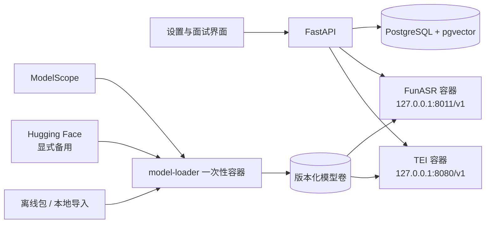

# Docker 本地 AI 与实时面试稳定性设计

> 产品：Interview Helper
>
> 日期：2026-07-25
>
> 状态：设计已确认，待用户复核后进入实施计划
> 范围：本地语音转写、本地向量检索、模型交付与实时面试可靠性

本设计补充而非替代 [Qwen ASR Flash 直连设计](2026-07-25-qwen-asr-flash-direct-transcription-design.md)：后者仍是云端专用 ASR 选项；本设计定义与它并列的、仅通过 Docker 运行的本地路线。

## 1. 已确认决策

1. 本地语音转写和本地 embedding **只通过 Docker 运行**。宿主机不安装 FunASR、TEI、PyTorch、Python sidecar 或模型运行时；对现有应用而言，Docker Desktop 是本地 AI 运行时唯一新增的宿主前置条件。
2. 云端 API、轻量本地 embedding 与高质量本地 embedding 并列，由用户显式选择；不强制使用 Qwen。
3. 本地模型权重默认从 ModelScope 下载；Hugging Face 是用户显式选择的备用来源；受支持模型还必须支持校验后的离线导入。
4. 模型下载、镜像拉取、模型预热、重嵌入和 HNSW 建索引只能在设置/维护流程运行。面试进行中禁止启动这些任务。
5. 本地服务故障不会静默上传音频、简历或记忆到云端。语音始终保留文字回答入口；向量检索故障回退到 PostgreSQL 全文检索。
6. 实时面试继续使用 WebSocket，不为实时问答额外引入 SSE；后台长任务继续复用现有 job/SSE 机制。

## 2. 目标与非目标

### 目标

- 中国大陆网络环境下可安装、可续传、可校验、可离线导入的本地模型。
- 用户开始面试后不遭遇下载、冷启动、GPU 抢占或无限等待。
- 回答不丢失、不重复提交；断线、刷新和短暂服务重启后可恢复本轮面试。
- 等待状态对应真实系统阶段，并提供可理解的恢复动作。
- 不引入独立向量数据库，使用 PostgreSQL + pgvector 增强既有全文检索。

### 非目标

- 不自动安装 Docker Desktop、显卡驱动或 WSL；应用只做检测、引导和受控编排。
- 不默认运行多个本地大模型，也不在面试中实时生成 embedding。
- 不把任意第三方镜像站或模型目录视为可信来源。
- 不承诺所有显卡、所有 Docker 镜像源或离线包都可零配置运行。

## 3. Docker-only 架构



Docker Compose 采用独立 profile：

| Profile / 服务 | 职责 | 是否长期运行 |
| --- | --- | --- |
| `core` / `postgres` | PostgreSQL 17、pgvector、业务数据 | 是 |
| `model-loader` | 下载、续传、校验、导入、冒烟测试与原子切换 | 否，一次性任务 |
| `local-asr` | FunASR + FFmpeg，提供 transcription API | 用户启用时 |
| `local-embeddings` | TEI，提供 embeddings API | 用户启用时 |

端口仅绑定回环地址。若 FastAPI 也容器化，则使用 Docker service DNS；若 FastAPI 保持宿主运行，则访问 `127.0.0.1` 映射端口。不得把 ASR、embedding 或 Docker socket 暴露给局域网或浏览器前端。

首个受支持的图形化安装目标是 Windows 10/11 的 Docker Desktop（Linux containers + WSL2）。安装向导先检测 Docker、磁盘、可用内存和 GPU；具备受支持 NVIDIA/WSL2 GPU 路径的用户可启用 GPU 容器，未通过检测时仍可选择 CPU 容器。Docker Desktop/GPU/模型任一项未就绪时，界面保留云端 API 与纯文字路径，不把原生依赖安装作为修复方案。

## 4. 模型交付与离线可用性

### 4.1 受支持预设

| 能力 | 预设 | ModelScope 默认来源 | 运行方式 |
| --- | --- | --- | --- |
| 语音转文字 | SenseVoiceSmall | `iic/SenseVoiceSmall` | FunASR 容器 |
| 轻量向量检索 | multilingual-e5-small | `intfloat/multilingual-e5-small` | TEI CPU/GPU 容器 |
| 高质量向量检索 | BGE-M3 | `BAAI/bge-m3` | TEI CPU/GPU 容器 |

每个发布版本都包含版本化 preset manifest：模型 ID、固定 revision、文件清单、SHA-256、磁盘空间、维度、许可证、伴随模型、服务镜像 digest 与冒烟测试参数。发布时生成并锁定 manifest，不能依赖可变的 `main` 或 `latest`。

### 4.2 loader 状态机

```text
检查 Docker / 磁盘 / GPU
  -> 下载到 <preset>/<revision>.staging
  -> 断点续传与退避重试
  -> 逐文件 SHA-256 校验
  -> 启动临时容器进行真实推理测试
  -> 原子标记为 active
  -> 启动或热更新常驻服务
```

`model-loader` 容器使用锁定版本的 `modelscope-hub`，并在 named volume 中保存下载状态。它需要支持 HTTP Range 续传、文件锁、离线校验和进度回调。旧 active 模型在新版本通过校验前持续可用；失败只保留 staging，不影响已安装服务。

模型来源优先级：

1. 已验证 revision 的 ModelScope；
2. 用户显式选定的 Hugging Face 同 revision 来源；
3. 带 manifest 的离线包或本地文件夹导入。

离线导入只能接受受支持 preset 的完整 manifest。高级用户若想使用任意模型，走“自定义 OpenAI-compatible embedding API”，而不是绕过本地模型校验。

TEI 从 loader 已下载并挂载的本地目录启动；FunASR 同样从本地模型路径启动。运行服务不得在首个请求时联网下载主模型、VAD、标点或其他伴随模型。

模型权重、容器镜像与应用依赖是三套独立交付物。镜像必须固定 tag/digest；未来离线包可额外包含 `docker save` 产物。ModelScope 解决模型权重可达性，不假设它天然解决镜像拉取可达性。

## 5. 用户选择与连接契约

### 5.1 向量检索

设置页展示三个互斥选择：

| 选择 | 行为 |
| --- | --- |
| 云端 API | 用户配置支持 `/v1/embeddings` 的服务与模型 |
| 本地轻量 | 安装并绑定 Docker 中的 multilingual-e5-small |
| 本地高质量 | 安装并绑定 Docker 中的 BGE-M3 |

一次只能有一个 active embedding profile。profile 固定模型、revision、维度、归一化方式、查询指令和索引空间。切换模型会创建新 profile 并后台重嵌入；新 profile 完成后原子切换，旧/新向量绝不混检。

本地服务使用 OpenAI-compatible `POST /v1/embeddings`。后端新增专用 `openai_embedding` / `local_openai_embedding` 能力校验，普通聊天模型不能误绑到 embedding 角色。

### 5.2 语音转文字

语音转写设置并列显示：

- 云端 API：现有或后续支持的专用 ASR 连接，例如 DashScope Qwen ASR；
- 本地离线：Docker 中的 FunASR SenseVoiceSmall；
- 高级手动接入：用户已有的兼容 `/v1/audio/transcriptions` 服务。

Docker 中的 FunASR 只绑定 `127.0.0.1:8011`，带 FFmpeg，并通过 `/v1/audio/transcriptions` 兼容现有浏览器 `webm` / `m4a` 录音流程。后端应引入专用本地转写连接类型，避免 DeepSeek 等聊天连接出现在转写角色候选中。

## 6. pgvector 与混合检索

`postgres` 使用锁定版本的 pgvector PostgreSQL 17 镜像。Alembic 迁移先执行 `CREATE EXTENSION IF NOT EXISTS vector`，并创建独立 embedding 表，而不是把不同模型的向量直接写入 `MemoryItem`。

已有本地 PostgreSQL volume 升级到 pgvector 镜像前，必须先做备份、在副本上验证兼容性并通过 Alembic 迁移；不得以替换容器或重建 volume 的方式冒险升级用户数据。

第一阶段只增强已确认的长期记忆；随后扩展到题库解析和简历分块。每条向量附带 profile ID、内容哈希、来源 ID、profile/user/company/岗位范围、状态和生成时间。

检索顺序：

1. 先应用 profile、权限、状态、公司、岗位和过期过滤；
2. pgvector 获取语义候选；
3. 既有 PostgreSQL 全文检索获取词法候选；
4. 融合候选并复用既有 pinned、置信度、时效和上下文排序；
5. 按 token 预算裁剪。

embedding 服务、向量写入、HNSW 构建或模型不可用时，保留全文检索结果并记录无敏感正文的诊断原因。小数据集先用精确搜索；数据达到数千 chunks 后由后台建立 HNSW cosine 索引。

## 7. 面试稳定性与资源隔离

### 7.1 开始前准备门

用户点击开始面试前，系统并行检查：主面试官连接、数据库、WebSocket、题目计划、本地 ASR（若选中）和 embedding（若选中）。只有关键项失败时阻止开始；embedding 失败只提示“本场使用全文检索”。

本地服务必须先完成容器 health check 和一次真实的短音频/embedding 冒烟测试，再显示“可用于面试”。模型预热发生在此阶段，不发生在用户第一次回答时。

### 7.2 资源优先级

```text
P0 当前语音转写、当前面试官流式回复、WebSocket 恢复
P1 当前轮上下文构建与必要的只读检索
P2 摘要、记忆写入、报告生成
P3 模型下载、镜像拉取、重嵌入、HNSW 建索引、题目发现
```

面试开始时暂停 P3，限制 P2 并发。GPU 同一时刻优先服务实时 ASR 与面试，不允许 8GB 以下显存默认并发运行 BGE-M3 GPU 批处理；embedding 可改 CPU 后台或等待面试结束。

### 7.3 转写

录音页面展示真实阶段：`音频已提交 -> 正在转写 -> 请确认文本`，显示已等待时间并提供“取消转写 / 改用文字”。单段录音限制在 90–120 秒并提前提示。转写失败或超时不阻塞文字回答，也不自动把音频发送到云端。

## 8. 可恢复的实时回合

当前 WebSocket 已有回答落库、事件回放和单回合锁；本设计补足“连接断开不能取消生成”的边界。

1. 用户答案落库后立即持久化 `turn.state=preparing`；
2. 模型生成与某一 WebSocket 连接解耦。客户端断线只停止向该 socket 推送，不取消 provider 流；
3. assistant 最终消息必须先持久化，再向当前所有活跃连接广播；
4. 重连后若发现未完成 turn，界面显示“回答已保存，正在恢复生成”；服务重启或租约超时后将其标记为可重新生成；
5. 客户端重连采用带抖动的指数退避 `1s -> 2s -> 4s -> 8s -> 15s`，成功后回放事件并获取会话快照兜底；
6. 心跳每 20–30 秒发送一次非持久事件；1008/1009 等不可恢复关闭不无限重连。

模型流超时拆分为可按连接配置的预算：连接 5 秒、首 token 12–15 秒、流中空档 20–30 秒、单轮总时长 60–75 秒。仅在尚未输出任何 token 且错误可重试时自动重试一次；已输出部分内容时只提供“重新生成本轮追问”，避免重复内容。

每轮记录不含正文的 `context_ms`、`time_to_first_token_ms`、`total_turn_ms`、重连和重试指标，用于诊断页的 P50/P95。

## 9. 有意义的等待体验

不显示虚假的百分比或“思考过程”。界面只呈现真实完成的阶段：

```text
✓ 回答已保存
✓ 已准备：公司 / 轮次 / 岗位 / 已选简历上下文
→ 正在整理本轮上下文
→ 正在请求面试官模型
→ 面试官正在输入
✓ 已送达
```

- 提交后立即把用户回答显示为已保存；
- 8 秒后才提示“本次响应比平时久”，并显示真实等待时间；
- 首个 token 到达后切换为流式回答，前端按 30–50ms 批量刷新，避免本地快模型造成高频 React 重绘；
- 断线时明确说明“不会重复提交已确认回答”；
- 发生可恢复错误时提供“重新生成追问、继续等待、暂停面试、切换已配置备用模型”；不静默切换模型；
- 系统等待面试官、转写或故障恢复期间暂停面试倒计时，用户不为系统延迟损失练习时间。

## 10. 隐私与安全

- Docker 服务只开放回环地址；前端永远不能访问 Docker socket 或执行任意 shell/compose 命令。
- 应用只允许固定的、参数白名单化的 compose 操作：检测、拉取受信镜像、启动、停止、日志摘要、修复、卸载。
- API Key、原始音频、Base64 音频、完整回答、完整 prompt 与模型源凭证不写入日志、诊断快照或后台 job payload。
- 本地服务失败时保留显式云端切换入口，但默认不迁移数据。

## 11. 验收与分期

### Phase A：容器基础与交付

- pgvector PostgreSQL 镜像、Docker 环境诊断、模型 manifest、loader、ModelScope 下载、断点续传、离线导入和 health/冒烟测试。

### Phase B：本地能力接入

- FunASR Docker 转写、TEI Docker embedding、专用连接类型、三选一 embedding 设置和全文检索降级。

### Phase C：实时可靠性

- durable turn 状态、断线不中断生成、退避重连、阶段事件、分段超时、计时公平与延迟诊断。

### 核心验收标准

- 回答保存确认 P95 小于 500ms；上下文准备 P95 小于 1.5s；首 token 目标 P95 小于 8s，15 秒后进入可解释等待状态。
- 本地 GPU 短音频转写目标小于 15s，CPU 小于 30s；所有失败均保留文字回答路径。
- 任何网络断开、容器重启或 provider 超时后：已确认回答不丢、不重复、可恢复或可明确重试。
- 面试进行中不发生模型下载、镜像拉取、首次模型加载或 HNSW 建索引。
